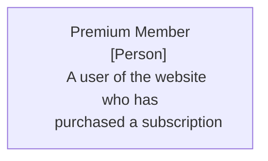
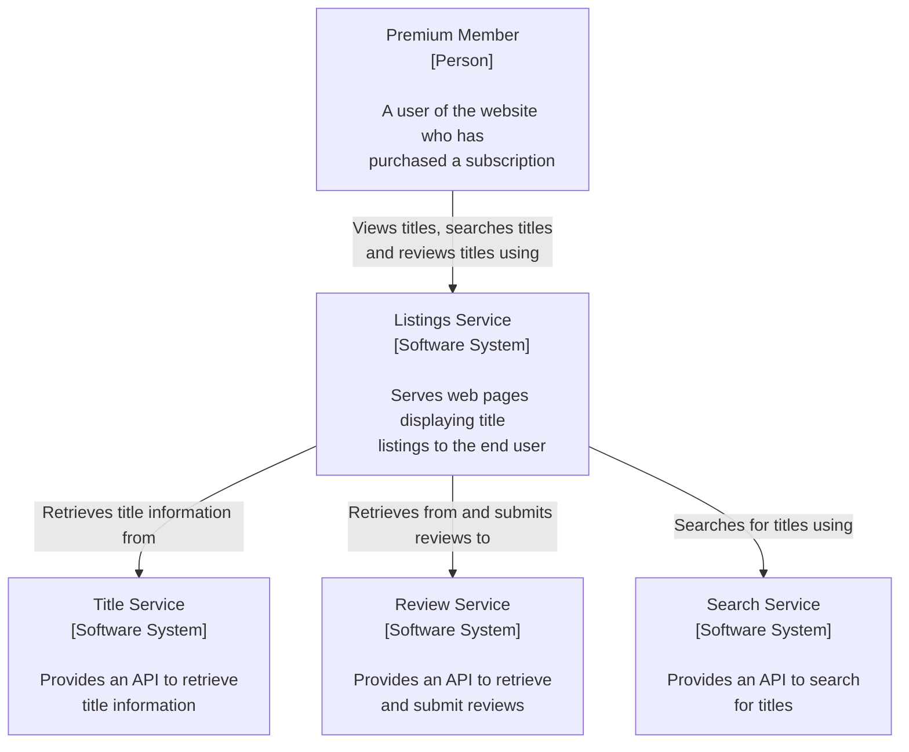
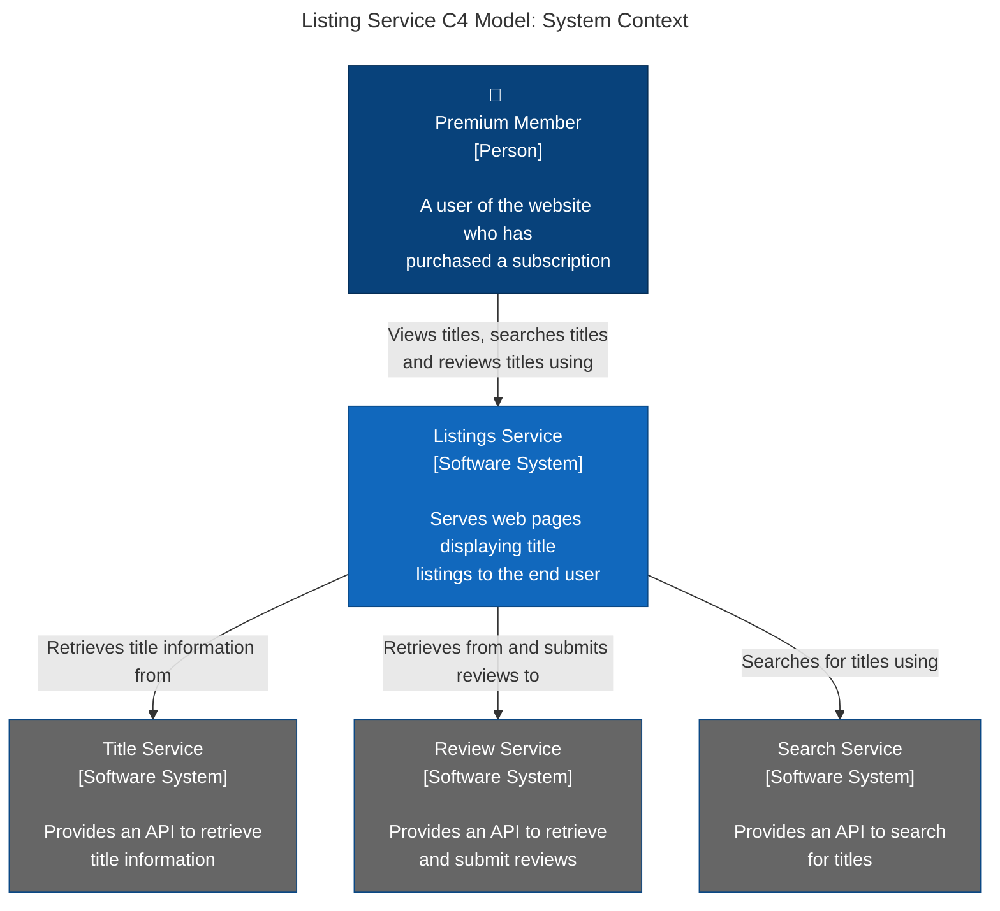
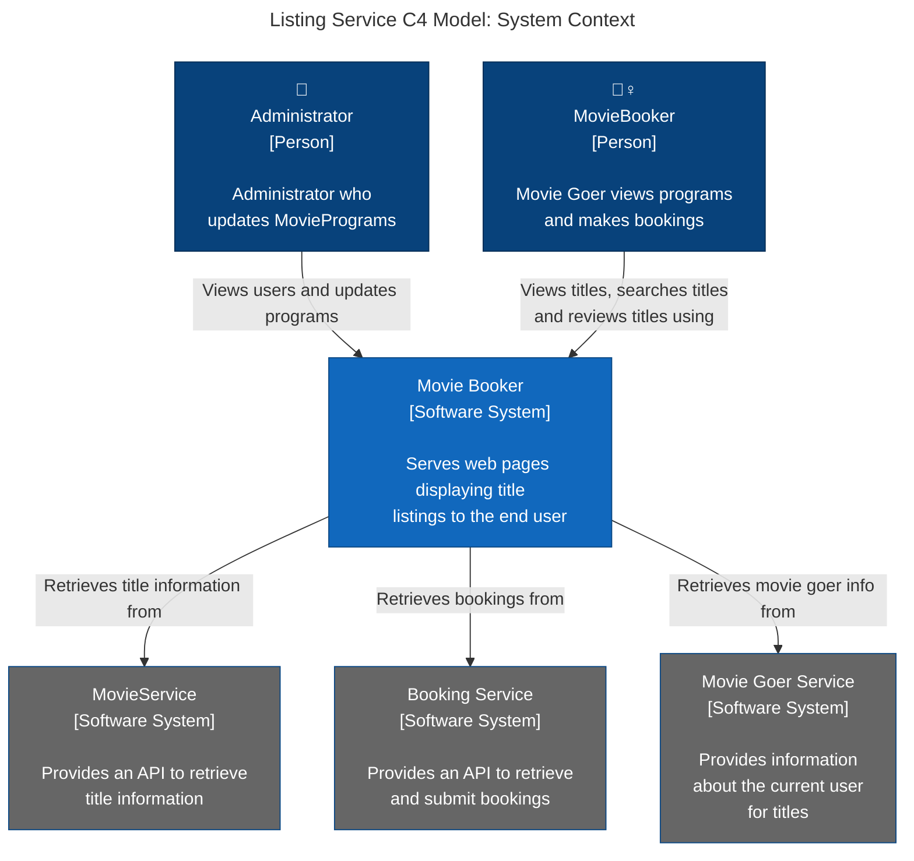
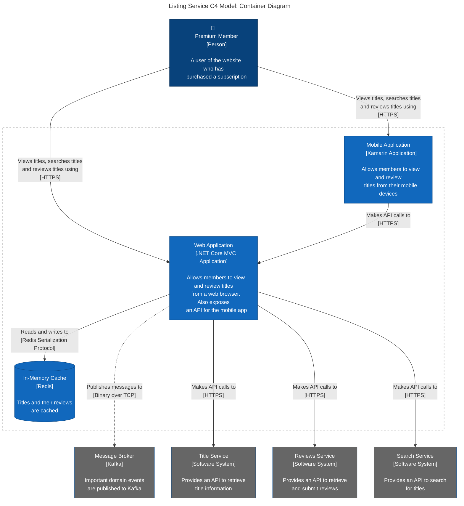
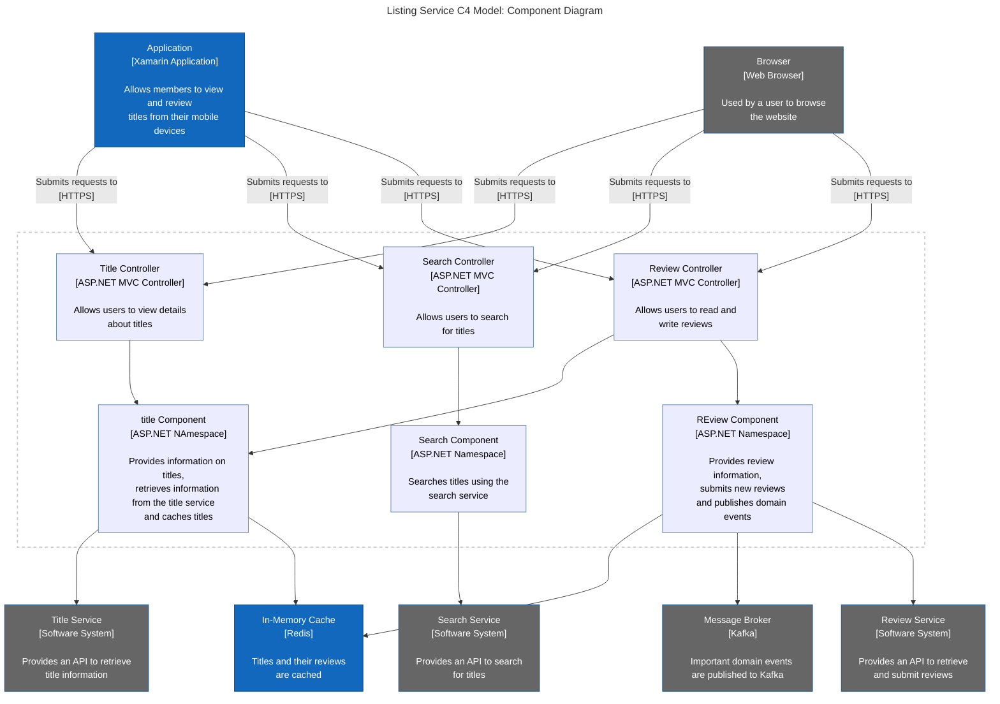

### DDD starter modelling
This video is quite good for an overview of DDD starter modelling:
https://www.youtube.com/watch?v=qeir72soorI

The speaker Maxime Sanglan-Charlier refers to this repository:
https://github.com/ddd-crew/ddd-starter-modelling-process

In this repo, I am trying to gather the resources mentioned and to give an overview of the different stages of the process
which the DDD crew, Maxime Sanglan-Charlier, Nick Tune and Michael Plod suggest can be useful in order to understand and build successful
Domain Driven architecture.

This diagram shows the different stages of the process. The stages move from a mile high context overview of the business 
moving down to a deeper understanding of the domain and business rules that make up the code:

Here we can see that the different stages are grouped into broad areas. We have align and understand which 
means getting the vision of the project and understanding the business value. Strategic architecture describes how to 
group the events identified in the align and understand stage. In the strategy section, the emphasis is on how to direct team effort
towards sucessful domain development. This section also includes some work on Team Topologies and business strategy: 

Next we will look at each of the stages in turn and document the tools that we can use to enable good progress during each
stage:

#### Understand
First we look at the Understand stage. In this stage the challenge is to understand the business model and user needs.

In this stage we are looking for an overarching understanding of the domain

### What?
- The business model
- Users needs
- Value propositions

### Why?
- Any decisions should be aligned with business goals
- Share short, medium & long-term vision
- Give meaning to the team

This tool looks quite interesting for understanding the key areas of the business. It does seem that it might be possible to use
this on a project level. The Key Partners might be collaborators for the project including other teams and companies, key activties
would describe the problem that the project solves. This business model canvas does seem quite high level for a developer.

A more focused tool could include the product vision board as focused on one product:

I think this tool is a bit more focussed for developers and might be a better way for developer to understand the value that is
offered by the project.

Impact mapping is another tool for product oriented vision:

Impact mapping is used by Gojko Adzic:
https://www.youtube.com/watch?v=ZgHkdJ6T8oQ
The main point here is that we are creating a map which is focussed on business goals. Here the developers are not necessarily
involved in ticket creation so it may be less important for developers to use this tool. The main point here is to gain context
so that ticket creators are able to clearly understand whether tickets are related to business goals.

The challenge with the above tools is to work out how to avoid merely tracking activity and ensure that there tasks are focused on the
usefulness of what teams are trying to deliver.

### Discover
The discover stage can include event storming and focusses on representing the domain visually and collaboratively.

### What?
- The domain
- The (ubiquitous) language, common vocabulary

### Why?
- Build a common ground
- Align all the stakeholders on the same level of understanding
- Put the puzzle together

#### Event Storming
Alberto Brandolini

### User Story Mapping
User story mapping is another tool for relating tickets to high level tasks users can do in the product that
the project is implementing:

### Domain Storytelling
Domain storytelling is a tool for understanding the interactions that users have with the business.
This site is quite easy to use and can be a useful tool for understanding business processes in the application
teams are building:
https://egon.io/app/

https://github.com/WPS/egon.io-examples/tree/main

Here are a few domain storytelling examples for reference:
### Taxi example

### cinema example

#### Web account

### Decompose
The decompose stage is focussed on splitting the domain into sub-domains.

#### What?
- The domain in sub domains

#### Why?
- Lowering cognitive load
- More autonomy
- High cohesion and low coupling
- Trace the architecture boundaries

The below diagram is quite useful to visualise how a domain might be split into separate subdomains:
https://microservices.io/patterns/decomposition/decompose-by-subdomain.html

### Connect
In the connect stage we are trying to use the subdomains we have identified to build a loosely coupled architecture:

#### What?
- The sub domains

#### Why?
- Identify interactions and dependencies
- Validation through real use cases
- Better defined boundaries
- Find exchanged messages

https://github.com/ddd-crew/domain-message-flow-modelling

### Domain Message Flow Modelling

Designing loosely-coupled systems requires more than carefully designed boundaries. Carefully defined interactions between bounded contexts is equally important.

A [bounded context](https://martinfowler.com/bliki/BoundedContext.html) is a sub-system in a software architecture aligned to a part of the domain. It can be implemented as a microservice or a module within a monolith.

A Domain Message Flow Diagram is a simple visualisation showing the flow of messages (commands, events, queries) between actors, bounded contexts, and systems, for a single scenario.

### Separate Message & Contents

The separate message & contents format uses 2 shapes for each message: 1 for the name and order of the message and a separate box to display the contents of the message (the information it carries).

The benefit of this format is that you can focus on the flow of messages without getting bogged down by the message contents at the start.

Start by showing just the messages flowing between senders and receivers (with the order number on the message).

Then show the contents of each message in a separate box next to each message:

### Combined Message & Contents

The combined message & contents format uses a single shape to capture the message name, order, and contents.

#### How to Use

When you have an initial cut of your architecture - you have identified candidate bounded contexts - you can begin design the message flows.

Start by creating a list of scenarios to model. And then for each scenario create a diagram

When creating a diagram, the typical flow is:

1. Start with an actor/context/system
2. Create the message they want to send
3. Add the recipient of the message and a line connecting the sender and the receiver
4. Place the message close to the line
5. Repeat steps 1 - 4 until your scenario is complete

The message should contain 3 elements:

1. The name of the message
2. The significant data contained within the message
3. The order in which the message occurs in the flow being modelled

#### Context mapping
This video from Michael Plod is quite useful on context mapping:
https://www.youtube.com/watch?v=VjtMt689ql8

"A loosely coupled software architecture and org structure to match" is a key predictor of:
- Continuous Delivery Performance
- Ability to scale organization and increase performance linearly

#### Patterns to describe the contact between bounded contexts and teams
- open / host service (shared API)
- conformist
- anti corruption layer (transforms data for use in the application)
- shared kernel (shared artifact between two teams, e.g. database)
- customer / supplier (downstream is the customer of the supplier(upstream))
- partnership (cooperative relationship between two teams)
- published language (e.g. calendar invites follow a published language .ics)
- separate ways (bounded contexts have no connections)
- big ball of mud (part of a system that is a mess)

Context Maps aim to deliver a holistic overview regarding coupling of bounded contexts.

With context mapping we focus on dependencies between bounded contexts:

The focus is on how teams interact:

### Strategise
This is the stage where teams can strategise using all the subdomains discovered with the above tools.

#### What?
- The sub domains

#### Why?
- Identify core sub domains
- Focus on what's important
- Build vs Buy
- Help to think short, medium and long-term

Teams would then place the different parts of the application in the correct places on the below graph:

This would help them identify which tool is core for the business and which tools are supporting or generic.
- core - usp - unique selling proposition - make application different
    - cinema management - movies + cinemas
- supporting
    - anything that is required to perform business - but not core business
    - loyalty card - not required for core business but necessary to support business
- generic
    - supports business but generic to any business
    - invoicing

### Organise

#### What?
- Teams

#### Why?
- Identify teams' dependencies and responsibilities
- Lower cognitive load
- Limit context switching
- Consider org constraints

Each service must be fully owned by a team with sufficient cognitive capacity to build and operate it.

#### Cognitive load
Hacking Your Head Managing Information Overload
Jo Pearce
https://www.youtube.com/watch?v=DUlFxffjDFo

- intrinsic (how do I write a Java class)
- extraneous (how do I deploy this app)
- germane (business problems)

Manage intrinsic load, reduce irrelevant load, increase relevant load = Efficient learning and increased productivity

### Define
In the define stage teams would identify bounded contexts and aim to document the inbound and outbound communications
to and from the API.

#### What?
- purpose
- roles and traits

#### Why?
- Challenge the boundaries
- New perspective
- Documentation

#### Using the C4 Model
The C4 model can also be a useful tool during the define stage.
The C4 diagram has four parts:
- System Context
- Container
- Component
- Code

For the moment we will focus on the first three parts of the C4 diagram. There are three main elements to the System Context
diagram:
- people
- Your software system (that you are designing)
- Supporting software systems

We will start by adding Nodes:

There are various options for the direction of the flowchart:
- TB: top-to-bottom
- TD: top-down
- BT: bottom-to-top
- RL: right-to-left
- LR: left-to-right

#### Adding Style

We can now add style to the nodes:

#### MovieBooker System Context

#### Detail the System's Containers

For the Container diagram, the second level of the C4 diagrams, we can talk about further detail
for the containers that are in play:
- A mobile application for mobile users
- A web application that serves web browsers and also hosts an API for the mobile app to retrieve/send data to/from
- A Redis instance for caching, to prevent repeated API calls to downstream services, such as the title service

We also have a message broker in the form of Kafka, that we send domain events to when important things happen
such as when a user views listings or a user watches a title.

This is a list of arrow types for mermaid diagrams:

#### Component diagrams
Often the System Context and the Container diagram are enough in terms of higher level architectural detail.
However, it can be useful at times to create a component diagram.

